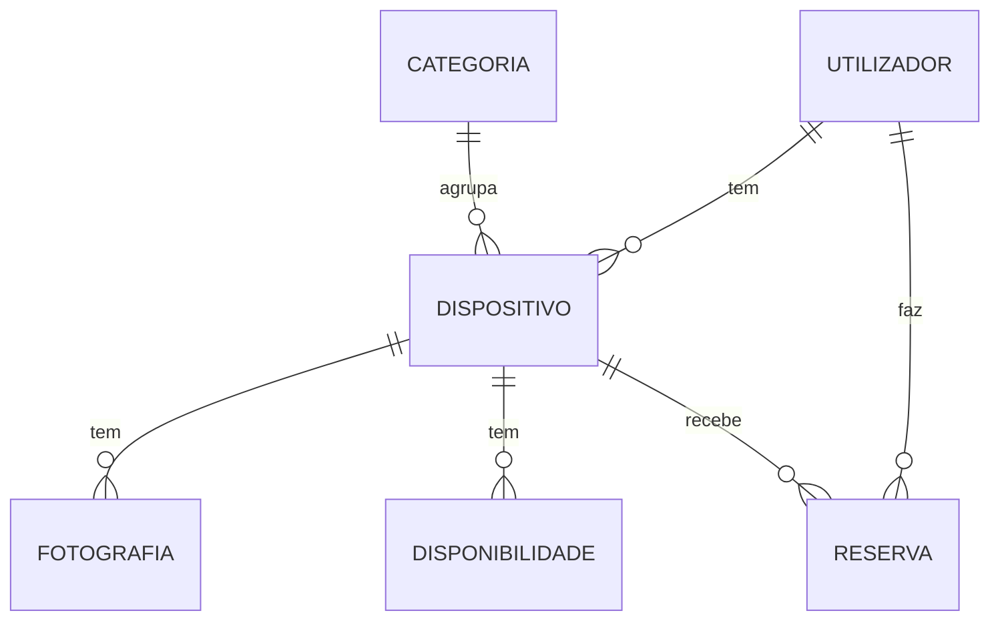
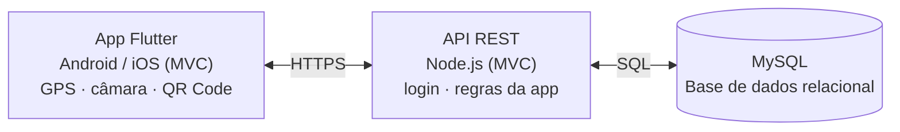

# Share IT

Aplicação móvel de arrendamento de dispositivos eletrónicos

## Proposta Inicial do Projeto (v1)

Projeto Multidisciplinar · Licenciatura em Engenharia Informática
3.º semestre · 2026-2027
Universidade Europeia · IADE – Faculdade de Design, Tecnologia e Comunicação

**Grupo g07**

- Augusto Mendes – 20252082
- Bernardo Bravo – 20251740
- Denzel Antunes – 20251702
- Guilherme Rodrigues – 20251680

**Repositório:** https://github.com/Edthegreat100/share_it

Lisboa · 2026

---

## 1. Identificação

| Campo | Informação |
|---|---|
| Universidade | Universidade Europeia |
| Faculdade | IADE – Faculdade de Design, Tecnologia e Comunicação |
| Curso / Semestre | Licenciatura em Engenharia Informática – 3.º semestre, 2026-2027 |
| Projeto | Share It – aplicação móvel de arrendamento de dispositivos eletrónicos entre pessoas |
| Grupo | g07 |
| Elementos | Augusto Mendes – 20252082; Bernardo Bravo – 20251740; Denzel Antunes – 20251702; Guilherme Rodrigues – 20251680 |
| Repositório GitHub | https://github.com/Edthegreat100/share_it |
| Entrega | 1.ª entrega – Proposta inicial (g07-proposta-v1.pdf), 04.10.2026 |

## 2. Palavras-chave

Economia partilhada; arrendamento de dispositivos; aplicação móvel; Flutter; REST; MySQL; localização; QR Code; sustentabilidade.

## 3. Descrição da aplicação e do problema

Share IT é uma aplicação para telemóvel onde as pessoas alugam, por poucos dias, aparelhos eletrónicos que são de outros utilizadores: consolas (PS5), televisões, iPads, câmaras, projetores, colunas, entre outros. Quem tem um aparelho parado em casa pode ganhar algum dinheiro com ele. Quem precisa dele só por um fim de semana paga apenas esses dias.

**Problema.** Comprar um aparelho caro para usar poucas vezes (uma televisão para uma festa, um iPad para uma viagem, uma consola para experimentar um jogo) não compensa. Ao mesmo tempo, muitos aparelhos passam semanas parados. Hoje, estes empréstimos fazem-se em grupos de redes sociais ou em sites de anúncios gerais. Aí não há calendário de datas livres, não há garantia de que o aparelho volta, não fica registado em que estado estava e as pessoas não se conhecem.

**Solução.** Uma aplicação que junta tudo num só sítio: anúncios com fotografias e calendário, procura de aparelhos perto de nós num mapa, reserva com calendário, e entrega e devolução confirmadas com QR Code (um código que se lê com a câmara). Se houver tempo, acrescentamos pagamento simulado com caução (dinheiro guardado até o aparelho ser devolvido bem) e avaliações para criar confiança entre as pessoas.

## 4. Objetivos e motivação

### 4.1 Motivação

- Comprar menos aparelhos novos e usar mais tempo os que já existem (economia circular).
- Permitir que estudantes e jovens usem tecnologia cara sem a ter de comprar.
- Fazer um projeto que use o que o telemóvel tem de especial (localização, câmara, mapas), como pede o briefing.

**Contexto.** Em 2022, o mundo produziu 62 milhões de toneladas de lixo eletrónico, mais 82% do que em 2010. A previsão é chegar aos 82 milhões de toneladas em 2030. Só cerca de 22% foi reciclado de forma oficial (ITU e UNITAR, 2024). Se cada aparelho for usado por mais pessoas, são precisos menos aparelhos novos. O Share It aplica esta ideia aos aparelhos eletrónicos.

### 4.2 Objetivos

- Criar uma app em Flutter/Dart, organizada em MVC, ligada a um servidor Node.js (API REST) e a uma base de dados MySQL.
- Permitir publicar, procurar, reservar, levantar e devolver aparelhos.
- Criar confiança com QR Code e, se houver tempo, caução simulada e avaliações.
- Cumprir o RGPD (lei de proteção de dados) e usar só dados inventados durante o desenvolvimento.
- Usar Matemática Discreta (método de Monte Carlo e estatística) numa funcionalidade da app.
- Trabalhar em equipa, por etapas curtas, com GitHub, GitHub Projects e Figma.

## 5. Público-alvo

| Segmento | Descrição | Necessidade principal |
|---|---|---|
| Arrendatários | Estudantes e jovens adultos (18–35), famílias, pequenos criadores de conteúdo | Usar um aparelho por pouco tempo sem o comprar |
| Proprietários | Pessoas com aparelhos pouco usados em casa | Ganhar dinheiro com aparelhos parados, em segurança |
| Eventos e viagens | Quem organiza uma festa, apresentação ou viagem | Ecrã, projetor ou tablet durante 1 a 3 dias |

**Personas provisórias:** (1) Lukati, 20 anos, estudante – quer jogar PS5 num fim de semana com amigos; (2) Miguel, 34 anos, funcionário de escritório – tem uma televisão 4K e um iPad parados e quer ganhar algum dinheiro extra. As versões finais serão confirmadas na 2.ª entrega.

## 6. Pesquisa de mercado

Comparação com aplicações e sites parecidos, e se funcionam em Portugal.

| Solução | Modelo | Em Portugal? | Limitações face ao Share It |
|---|---|---|---|
| Grover | Empresa que aluga tecnologia por mensalidade (de 1 a mais de 24 meses) | Não (entrega na Alemanha, Áustria, Espanha continental e Países Baixos) | Só aluga o stock da empresa; contratos mensais; não há aluguer entre pessoas |
| Hygglo (antigo Fat Llama) | Site e app de aluguer de objetos entre pessoas; o Fat Llama passou a Hygglo a 24.11.2025 | Não (Suécia, Noruega, Dinamarca, Finlândia, Reino Unido, EUA e Canadá) | Serve todo o tipo de objetos; pouco foco em tecnologia; não está disponível em Portugal |
| Shar | App portuguesa de aluguer entre pessoas, com caução e entrega combinada ou por DPD (Android e iOS) | Sim | Generalista (roupa, ferramentas, desporto, eletrónica, etc.); o Share It foca-se só em aparelhos eletrónicos |
| Alluga | Plataforma portuguesa de aluguer de objetos entre vizinhos (ferramentas, câmaras, instrumentos) | Sim | Generalista; não é feita só para aparelhos eletrónicos |
| OLX / Custojusto | Anúncios de compra e venda | Sim | Não tem calendário, caução, reservas nem confirmação da entrega |
| Grupos de redes sociais | Empréstimos combinados entre conhecidos | Sim | Sem garantias nem avaliações; difícil de organizar |

**Diferenciação.** O Share It é só para aparelhos eletrónicos, procura por proximidade no mapa, reserva por calendário e confirma a entrega e a devolução com QR Code, registando o estado do aparelho. Nas aplicações que funcionam em Portugal, o mais parecido é a Shar, que é generalista.

## 7. Guiões de teste e casos de utilização

### 7.1 Caso de utilização core – UC1: Alugar um aparelho

**Ator:** Arrendatário. **Pré-condição:** sessão iniciada.

1. O utilizador abre o mapa e vê os aparelhos disponíveis perto de si.
2. Filtra por categoria "Consolas" e escolhe uma PS5.
3. Vê as fotografias, a descrição e o preço por dia.
4. Escolhe as datas no calendário (só aparecem as datas livres).
5. Confirma o pedido e o proprietário aceita a reserva.
6. No levantamento, mostra o QR Code da reserva; o proprietário lê-o e escreve em que estado está o aparelho.

**Resultado:** reserva ativa e aparelho entregue, com o estado registado.
**Extras (se houver tempo):** pagamento simulado com caução e notificação quando o proprietário aceita.

### 7.2 UC2: Publicar um aparelho para alugar

**Ator:** Proprietário. **Pré-condição:** sessão iniciada.

1. Toca em "Adicionar aparelho".
2. Escolhe a categoria e preenche marca, modelo, descrição e estado.
3. Tira ou carrega fotografias com a câmara do telemóvel.
4. Define o preço por dia e as datas em que o aparelho está livre.
5. Marca no mapa onde se pode levantar o aparelho (localização aproximada, para proteger a privacidade) e publica o anúncio.

**Resultado:** o anúncio aparece na lista "Os meus aparelhos".

### 7.3 UC3: Devolver o aparelho

**Ator:** Arrendatário e Proprietário. **Pré-condição:** reserva ativa.

1. No fim do período, o arrendatário abre a reserva e toca em "Devolver".
2. A app mostra o QR Code de devolução da reserva (gerado pelo servidor).
3. O proprietário lê o QR Code, confere o estado do aparelho e escreve-o (se houver danos, regista-o por escrito).
4. A reserva passa a "concluída".

**Extras (se houver tempo):** libertar ou reter a caução e avaliar a experiência (1 a 5 e comentário).

## 8. Solução a implementar

### 8.1 Descrição genérica

A aplicação tem três partes: a app no telemóvel (Flutter), o servidor (Node.js com API REST) e a base de dados (MySQL). A app pede informação ao servidor e o servidor vai buscá-la à base de dados.

O código é dividido em partes com funções diferentes, seguindo o padrão MVC, na app e no servidor. Na app: os Models são os dados (por exemplo, um aparelho), as Views são os ecrãs e os Controllers ligam os ecrãs aos dados e falam com o servidor. No servidor: os Models falam com a base de dados, os Controllers tratam os pedidos que chegam e as rotas indicam os endereços da API.

### 8.2 Funcionalidades principais

Essenciais:

- Registo, login e perfil, com opção de apagar a conta (só os dados necessários, com consentimento RGPD).
- Publicar e gerir aparelhos (criar, ver, editar e apagar, com fotografias).
- Procurar por texto, categoria e distância; ver os aparelhos no mapa.
- Reservas com calendário: o proprietário aceita ou recusa e o arrendatário pode cancelar (estados: pendente, aceite, ativa, concluída, cancelada).
- Entrega e devolução com QR Code validado pelo servidor, escrevendo o estado do aparelho.
- Matemática Discreta: sugerir um preço por dia com Monte Carlo e estatística simples (média, mediana e desvio padrão) sobre os preços da mesma categoria (a confirmar com os docentes; ver 8.3).

### 8.3 Enquadramento nas unidades curriculares

| Unidade curricular | Docente(s) | Contributo no Share It |
|---|---|---|
| Programação de Dispositivos Móveis | João Monge | App em Flutter/Dart, servidor Node.js (REST), ligação à base de dados, Git e documentação da API |
| Bases de Dados | Miguel Boavida | Modelo ER em MySQL; ficheiros create.sql, populate.sql e queries.sql; dicionário e guia de dados |
| Interfaces e Usabilidade | Paula Neves | Perguntar aos utilizadores, personas, mockups no Figma e testes de usabilidade |
| Redes e Comunicação de Dados | Nathan Campos; Pedro Rosa | Comunicação entre app e servidor, HTTPS, login seguro e validação dos tokens do QR Code no servidor |
| Matemática Discreta | André Torcato; Ricardo Sousa | Método de Monte Carlo (simulações com números aleatórios) para sugerir um preço por dia a partir dos preços de aparelhos da mesma categoria; estatística simples (média, mediana, desvio padrão). Proposta provisória, a confirmar com os docentes. |
| Projeto Mobile | Fabio Guilherme | Organização do trabalho, GitHub Projects, relatórios, apresentações, poster e vídeo |

### 8.4 Requisitos funcionais (RF) e não funcionais (RNF)

**Requisitos funcionais essenciais**

| ID | Requisito |
|---|---|
| RF01 | O utilizador pode registar-se, iniciar e terminar sessão. |
| RF02 | O utilizador pode ver e editar o perfil e apagar a conta. |
| RF03 | O proprietário pode criar, editar e apagar aparelhos, com fotografias. |
| RF04 | O utilizador pode procurar por texto e categoria, filtrar por distância e ver os aparelhos no mapa. |
| RF05 | Quem aluga pode reservar um aparelho para datas livres. |
| RF06 | O proprietário pode aceitar ou recusar reservas; o arrendatário pode cancelar antes do levantamento. |
| RF07 | A entrega e a devolução são confirmadas com QR Code e o estado do aparelho fica escrito. |
| RF08 | A app sugere um preço por dia (Monte Carlo e estatística simples). |

**Requisitos não funcionais**

| ID | Requisito |
|---|---|
| RNF01 | A app funciona em Android e iOS (Flutter). |
| RNF02 | Comunicação por HTTPS; palavras-passe guardadas de forma segura; login seguro. |
| RNF03 | Cumprir o RGPD; usar só dados inventados no desenvolvimento. |
| RNF04 | O servidor responde em menos de 2 segundos em condições normais. |
| RNF05 | Interface simples e coerente, seguindo regras de boa usabilidade. |

### 8.5 Modelo do domínio (provisório)

*Figura 1 – Modelo do domínio. Se houver tempo para os extras, acrescentam-se Pagamento, Avaliação e Notificação.*

| Entidade | Atributos principais | Relações |
|---|---|---|
| Utilizador | id, nome, email, palavra_passe_hash, localização aproximada | tem Dispositivos; faz Reservas |
| Categoria | id, nome | agrupa Dispositivos |
| Dispositivo | id, marca, modelo, descrição, estado, preço_dia, localização_aproximada, morada_levantamento | pertence a Utilizador e Categoria; tem Fotografias e Disponibilidades |
| Fotografia | id, url, ordem | pertence a Dispositivo |
| Disponibilidade | id, data_inicio, data_fim | associada a Dispositivo |
| Reserva | id, data_inicio, data_fim, preço_total, estado, token_levantamento, token_devolução, estado_ao_levantar, estado_ao_devolver | liga Utilizador (arrendatário) a Dispositivo |

### 8.6 Arquitetura da solução (provisória)

*Figura 2 – Arquitetura em três camadas.*

A app Flutter pede e envia informação à API REST por HTTPS. A API, feita em Node.js com MVC, verifica os pedidos, aplica as regras e lê ou guarda dados na base de dados MySQL. As fotografias são guardadas no servidor. Cada reserva tem dois tokens aleatórios gerados pelo servidor (levantamento e devolução). A app mostra o token como QR Code; a outra pessoa lê-o e a app envia-o à API, que valida se pertence àquela reserva. Assim o QR Code não pode ser inventado.

### 8.7 Tecnologias

| Camada | Tecnologia |
|---|---|
| Aplicação móvel | Flutter e Dart; Android Studio ou VS Code; plugins para mapas, câmara, leitura de QR Code e notificações |
| Servidor | Node.js, API REST, MVC, login seguro |
| Base de dados | MySQL (base de dados relacional) |
| Gestão e design | Git/GitHub, GitHub Projects, Figma |

### 8.8 Requisitos técnicos móveis

- Localização (GPS) e mapas para procurar aparelhos por distância.
- Câmara para tirar fotografias dos aparelhos e ler QR Codes.
- Notificações no telemóvel sobre reservas e devoluções (extra, se houver tempo).

### 8.9 RGPD

Pedimos só os dados necessários (nome, email e localização aproximada). O utilizador aceita o tratamento de dados no registo e pode apagar a conta e os dados (RF02). A morada exata de levantamento do aparelho só é enviada pela API ao arrendatário depois de a reserva estar aceite. As palavras-passe são guardadas apenas como hash (por exemplo, bcrypt), nunca em texto simples. No desenvolvimento usamos apenas dados inventados.

### 8.10 Mockups e interfaces

Os mockups (desenhos dos ecrãs) são feitos no Figma, a partir dos casos de utilização UC1 a UC3 (ver Anexo A).

Ligação para o projeto Figma: https://www.figma.com/design/UfhkEFMtLLWcQRDhwDdaOt/PBL?nodeid=0-1&t=QYVJVBWqZOaPhtSc-1

Nos ecrãs do Anexo A, a avaliação e o pagamento simulado são extras (ver 8.2). Faltam os ecrãs de login, "Os meus aparelhos" e pedidos recebidos, que serão acrescentados até à 2.ª entrega.

## 9. Planeamento e calendarização

### 9.1 Gráfico de Gantt

Semanas 1–14 (início a 07.09.2026). E1, E2 e E3 assinalam as entregas das semanas 4 (02.10.2026), 9 (06.11.2026) e 14 (11.12.2026).

Tarefas planeadas (o gráfico com as barras por semana está no PDF):

1. Ideação e validação com docentes
2. Proposta e pesquisa de mercado
3. Mockups (Figma) e guiões
4. Modelo ER, create/populate.sql
5. API REST Node.js
6. App Flutter – protótipo alfa
7. Documentação REST e dicionário
8. Matemática Discreta (Monte Carlo)
9. Reservas, QR Code, mapas (e extras)
10. Testes de usabilidade e correções
11. Relatório final, poster, vídeo

**E2 (06.11.2026):** servidor funcional, base de dados, app a consumir serviços (login, aparelhos, pesquisa), create.sql, populate.sql e queries.sql, documentação REST v1, dicionário e guia de dados, BD Report, esboço do diagrama de classes, personas e guiões finais, memória e arquivo documental atualizados.

**E3 (11.12.2026):** reservas, QR Code, mapas e sugestão de preço a funcionar; extras se houver tempo; manual do utilizador, poster, vídeo (3 min), slides (máx. 8) e app instalada no telemóvel.

### 9.2 Distribuição de tarefas

| Área | Responsável | Apoio |
|---|---|---|
| Gestão e documentação (GitHub Projects, relatórios, apresentações) | Bernardo Bravo | Denzel Antunes |
| Design e usabilidade (Figma, personas, testes) | Denzel Antunes | Guilherme Rodrigues |
| Base de dados (modelo ER, SQL) | Guilherme Rodrigues | Augusto Mendes |
| Backend/API (Node.js, documentação REST) | Bernardo Bravo | Guilherme Rodrigues |
| App móvel (Flutter): estrutura, login, reservas e QR Code | Augusto Mendes | Bernardo Bravo |
| App móvel (Flutter): mapa, pesquisa e ecrã de publicar aparelho | Denzel Antunes | Augusto Mendes |
| Matemática Discreta (Monte Carlo, estatística) | Guilherme Rodrigues | Denzel Antunes |

Cada tarefa será registada no GitHub Projects com responsável e estado.

### 9.3 Project Charter

| | |
|---|---|
| **Objetivo** | Entregar a app Share It a funcionar no telemóvel na 3.ª entrega (11.12.2026). |
| **Âmbito** | App, servidor (API REST), base de dados e documentação. Extras só se houver tempo: avaliações, notificações e pagamento simulado com caução. Fora do projeto: pagamentos reais. O repositório segue a estrutura de pastas do arquivo documental pedida no briefing (00_Identificacao a 07_Autorizacoes) e o README liga à pasta Documentos. |
| **Marcos** | E1: 02.10.2026 (proposta); E2: 06.11.2026 (protótipo alfa); E3: 11.12.2026 (versão final, poster e vídeo). A apresentação é na semana seguinte a cada entrega. |
| **Riscos e o que fazemos** | Riscos: atraso a ligar a app ao servidor; QR Code e mapas difíceis; falta de tempo; para testar em iOS é preciso um Mac. O que fazemos: entregar um pouco todas as semanas, fazer primeiro o essencial e testar principalmente em Android. |

### 9.4 WBS

| Pacote de trabalho | O que inclui |
|---|---|
| 1 Gestão e documentação | Relatórios, GitHub e GitHub Projects, arquivo documental |
| 2 Design e usabilidade | Personas, mockups no Figma e testes de usabilidade |
| 3 Base de dados | Modelo ER e ficheiros SQL (create, populate, queries) |
| 4 Servidor (API) | A parte que liga a app à base de dados, e a sua documentação |
| 5 App móvel | Os ecrãs e as funções da app em Flutter |
| 6 Matemática Discreta | Monte Carlo e estatística simples |
| 7 Testes | Testar a API e a app e corrigir erros |
| 8 Apresentação final | Poster, vídeo, slides, manual do utilizador |

## 10. Conclusão

O Share IT responde a um problema real: comprar aparelhos caros que só se usam de vez em quando. O projeto junta as várias unidades curriculares do semestre e usa funções do telemóvel como localização, câmara e mapas. Até à 2.ª entrega (06.11.2026) queremos ter uma primeira versão da app, com servidor e base de dados a funcionar. Até à 3.ª, queremos a versão final, com manual do utilizador, poster e vídeo.

**Objetivos a atingir:** UC1 a UC3 a funcionar; documentação da API, dicionário e guia de dados; testes de usabilidade; app instalada no telemóvel na apresentação final.

## 11. Bibliografia

- Documentação oficial: Flutter (https://docs.flutter.dev); Dart (https://dart.dev/guides); Node.js (https://nodejs.org); MySQL 8.0 (https://dev.mysql.com/doc).
- Bocoup. Documenting your API. https://bocoup.com/blog/documenting-your-api
- Nielsen, J. (1994). 10 Usability Heuristics for User Interface Design. Nielsen Norman Group. https://www.nngroup.com/articles/ten-usability-heuristics/
- Regulamento (UE) 2016/679 (RGPD), Parlamento Europeu e Conselho. https://eur-lex.europa.eu/eli/reg/2016/679/oj
- Concorrentes analisados: Grover (https://www.grover.com/de-en); Alluga (https://www.alluga.pt); OLX Portugal (https://www.olx.pt); CustoJusto (https://www.custojusto.pt).
- Hygglo (2025). Fat Llama will become Hygglo on Nov 24th. https://blog.hygglo.com/2025/10/02/fatllama-will-become-hygglo-on-nov-24th-why-when-and-what/
- Tek Notícias (2025). Nova app Shar quer "mudar o jogo" do aluguer de artigos. https://tek.sapo.pt/mobile/apps/artigos/nova-app-shar-quer-mudar-o-jogo-do-aluguer-de-artigos-em-nome-do-consumo-sustentavel/
- ITU; UNITAR (2024). Global E-waste Monitor 2024. https://unitar.org/about/news-stories/press/global-ewaste-monitor-2024-electronic-waste-rising-five-times-faster-documented-e-waste-recycling

Ligações consultadas em 03.10.2026

---

## Anexo A – Mockups e interfaces (Figma)

Ecrãs principais dos casos de utilização UC1 a UC3. Ligação para o Figma: ver secção 8.10.

- Figura A1 – Mapa e pesquisa (UC1)
- Figura A2 – Detalhe do aparelho e calendário (UC1)
- Figura A3 – Reserva (UC1)
- Figura A4 – QR Code de levantamento/devolução (UC1, UC3)
- Figura A5 – Publicar aparelho (UC2)
- Figura A6 – Devolução (UC3)

*Os ecrãs estão no PDF (`g07-proposta-v1.pdf`). Para os mostrar também aqui, exportem-nos do Figma e acrescentem, por exemplo, ``.*
